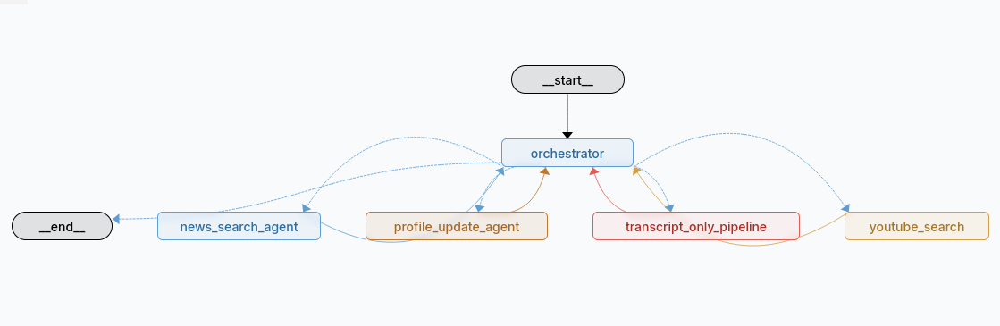

# 🌍 Language Learning Agent

An AI-powered agent that helps you improve language learning by finding relevant YouTube videos and news articles in your target language, tailored to your proficiency level and interests.

Built with **LangGraph**, **LangChain**, **DeepSeek**, and **Gradio**.

---

## Architecture Diagram



---

## Features

- 🎬 **YouTube video search** — finds videos in your target language at your CEFR level (A1–C2)
- 📰 **News article search** — fetches recent news in your target language matching your interests
- 📝 **Video transcript analysis** — paste a YouTube URL and get an instant level assessment
- 👤 **Persistent user profile** — remembers your interests, dislikes, language levels, and ratings across sessions
- 🧠 **Intelligent routing** — a multi-agent orchestrator understands your intent and routes to the right pipeline
- 💾 **Profile learning** — just tell the agent your preferences in natural language and it updates your profile automatically

---

## Project Structure

```
language-learning-agent/
├── agents/
│   ├── orchestrator.py          # Main orchestrator — parses intent and routes
│   ├── video_searcher.py          # YouTube search agent
│   ├── video_transcripter.py      # Transcript fetching and level assessment
│   ├── video_scorer.py         # Scores videos against user preferences
│   ├── news_searcher.py         # News search ReAct agent
│   ├── profile_updater.py       # Updates user profile using Trustcall
│   ├── pipelines.py             # Full search and transcript-only pipelines
│   └── shared.py                # Shared utilities: model, config, helpers
├── tools/
│   ├── rapidapi_youtube.py      # YouTube search tool (RapidAPI)
│   ├── youtube_transcript.py    # Transcript fetching tool
│   └── newsapi.py          # News search tool (NewsAPI)
├── prompts/
│   ├── orchestrator_prompt.py   # Orchestrator system prompt
│   ├── video_search_prompt.py   # YouTube search query generation prompt
│   ├── transcript_prompt.py     # Transcript analysis prompt
│   ├── video_score_prompt.py          # Video scoring prompt
│   ├── news_search_prompt.py    # News search query generation prompt
│   └── profile_prompt.py        # Profile update instructions for Trustcall
├── schemas/
│   └── schema.py                # Pydantic models: State, VideoInfo, NewsArticle, UserProfile, etc.
├── user_profile/
│   └── user_profile.yaml        # Default empty user profile template
├── tests/
│   ├── fixtures.py              # Mock videos, transcripts and news for testing
│   ├── test_orchestrator.py
│   ├── test_profile_updater.py
│   ├── test_video_searcher.py
│   ├── test_video_transcripter.py
│   ├── test_video_scorer.py
│   └── test_news_searcher.py
│   ├── test_transcript_api.py
├── graph.py                     # LangGraph StateGraph definition and compilation
├── ui.py                        # Gradio chat interface
├── main.py                      # Entry point for terminal usage
├── configuration.py             # RunnableConfig schema with user_id
├── .env.example                 # Example environment variables
├── requirements.txt             # Requirements for the conda env
└── README.md
```

### Key Components

**Orchestrator (`agents/orchestrator.py`)**
The central brain. Reads the user profile from the store, parses the user's message, and calls `ExecuteIntent` to signal the appropriate pipeline. Handles multi-intent messages (e.g. "I like sports, find me French sports videos") by routing sequentially.

**YouTube Search Pipeline (`agents/pipelines.py`)**
Runs three agents in sequence: Search Agent builds an optimised query in the target language and fetches videos → Transcript Agent fetches transcripts and assesses CEFR level → Scoring Agent ranks videos 0–100 against the user profile.

**News Searcher (`agents/news_searcher.py`)**
A **ReAct** agent that reasons about the user's preferences, constructs a search query in the target language, calls the NewsAPI tool, and returns a curated list of articles.

**Profile Updater (`agents/profile_updater.py`)**
Uses [Trustcall](https://github.com/hinthornw/trustcall) to intelligently update the user profile from conversation history — handles adding, removing, and modifying fields without overwriting unrelated data.

**Graph (`graph.py`)**
Defines the LangGraph `StateGraph` with conditional edges. The orchestrator routes to one of: `full_search_pipeline`, `transcript_only_pipeline`, `news_searcher`, or `profile_update_agent`, then loops back to the orchestrator for the final response.

---

## Setup

### Prerequisites

- Python 3.11+
- A [RapidAPI](https://rapidapi.com) account with the YouTube138 API enabled
- A [NewsAPI](https://newsapi.org) account (free tier: 100 requests/day)
- A [DeepSeek](https://platform.deepseek.com) API key

### Installation

```bash
git clone https://github.com/your-username/language-learning-agent
cd language-learning-agent
conda create --name language-learning-agent --file requirements.txt
```

### Environment Variables

Copy `.env.example` to `.env` and fill in your keys:

```bash
cp .env.example .env
```

```env
# ── LLM ───────────────────────────────────────────────────────
DEEPSEEK_API_KEY=your_deepseek_api_key

# ── YouTube Search (RapidAPI) ─────────────────────────────────
RAPIDAPI_KEY=your_rapidapi_key

# ── News Search ───────────────────────────────────────────────
NEWSAPI_KEY=your_newsapi_key

# ── LangSmith (optional — for tracing) ───────────────────────
LANGCHAIN_TRACING_V2=true
LANGCHAIN_API_KEY=your_langsmith_api_key
LANGCHAIN_PROJECT=language-learning-agent

# ── Development flags ─────────────────────────────────────────
USE_MOCK_DATA=false       # Set to true to use fixture data instead of real APIs
USE_MOCK_NEWS=false       # Set to true to use mock news articles
```

---

## Running the Agent

### Gradio UI (recommended)

```bash
python ui.py
```

Then open your browser at `http://localhost:7860`.

The UI has three panels:
- **Chat** — talk to the agent in natural language
- **Results tabs** — video and news results appear here after a search
- **Profile sidebar** — shows your current profile, updated automatically as you chat

### Terminal

```bash
python main.py
```

### LangGraph Studio

```bash
langgraph dev
```

Studio opens in your browser and lets you visualise the graph, run it step by step, and inspect state at each node.

---

## Example Interactions

```
You: Find me 5 French cooking videos at B1 level
Agent: 🎬 Searching YouTube and analyzing videos...
       → Returns 5 scored videos in the Videos tab

You: What are the latest news in Spanish about technology?
Agent: 📰 Searching for news articles...
       → Returns articles in the News tab

You: I speak German at B2 and I love history
Agent: 💾 Updating your profile...
       → Adds German B2 and history to your profile

You: Analyze this video in Spanish: https://www.youtube.com/watch?v=ABC123
Agent: 📝 Analyzing video transcript...
       → Returns detected CEFR level and explanation
       → The language of the video must be provided.
```

---

## Development

### Running Tests

```bash
# From project root
python -m pytest tests/ -v
```

### Using Mock Data

Set `USE_MOCK_DATA=true` and `USE_MOCK_NEWS=true` in your `.env` to use fixture data from `tests/fixtures.py` instead of hitting real APIs. Useful for development and testing without burning API credits.

### Caching Transcripts

Transcript API calls are cached in `cache/transcript/`. Delete this folder to force fresh fetches.

---

## Tech Stack

| Component | Technology |
|---|---|
| Agent orchestration | [LangGraph](https://langchain-ai.github.io/langgraph/) |
| LLM calls & tools | [LangChain](https://python.langchain.com/) |
| Language model | [DeepSeek](https://platform.deepseek.com) (`deepseek-chat`) |
| Profile memory | [Trustcall](https://github.com/hinthornw/trustcall) + SQLite |
| YouTube search | [RapidAPI YouTube138](https://rapidapi.com/ytdlfree/api/youtube138) |
| Transcripts | [youtube-transcript-api](https://github.com/jdepoix/youtube-transcript-api) |
| News search | [NewsAPI](https://newsapi.org) |
| Observability | [LangSmith](https://smith.langchain.com) |
| UI | [Gradio](https://gradio.app) |

---

## Known Limitations

- **YouTube transcript blocking** — YouTube may block transcript requests if too many are made in a short period. Use `USE_MOCK_DATA=true` during development or add delays between requests. See the [youtube-transcript-api docs](https://github.com/jdepoix/youtube-transcript-api#working-around-ip-bans) for workarounds.
- **NewsAPI free tier** — limited to 100 requests/day and articles older than 30 days on the free plan.
- **Language filtering** — YouTube's `hl`/`gl` API parameters are unreliable; the agent constructs queries in the target language instead for better results.
- **CEFR level assessment** — level detection is based on transcript samples (~50 snippets) and LLM judgment. Treat assessments as estimates rather than precise measurements.